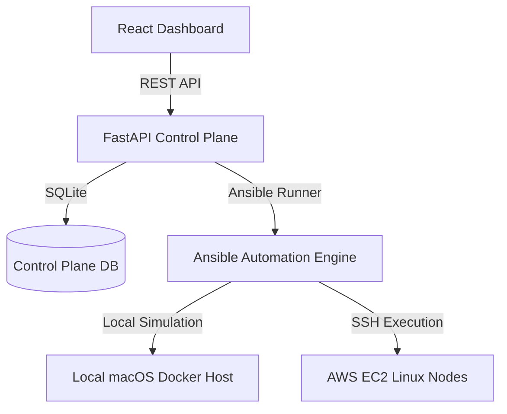

# PlatformOps Architecture

PlatformOps models a production-grade DevOps control plane with decoupled infrastructure management, dependency-aware rollouts, and lifecycle safeguards.

## Architecture Planes

### 1. Lifecycle Governance Plane
All actions that modify or delete resources run through the `lifecycle_impact(db, target_type, target_id)` safety checker.
- **Service Deletions**: Scans the active node for downstream services that depend on the target. Deletion is blocked (HTTP 409) if dependents exist or if the card belongs to protected infrastructure (e.g., `postgres-core`, `redis-core`, `rabbitmq-core`, etc.).
- **Node & Cluster Deletions**: Node deletion checks for active service instances. Cluster deletion checks for active nodes and services.
- **Audit Trails**: Blocked, warning-state, or successful deletions record structured `OperationalEvent` logs for auditing compliance.

### 2. Subsystem Orchestration Plane
Rather than managing cards individually, PlatformOps supports subsystem-level topological deployments.
- **Topological Sorting**: The backend recursively traverses dependency definitions in `catalog/dependencies.yaml` to generate duplicate-free, ordered step lists.
- **Plane Isolation**: Airflow workflows map isolated database instances (`airflow-postgres`, `airflow-redis`) to prevent global shared state pollution.
- **Simulation**: In local-mode, rollout orders simulate container configurations and trigger fake deployment state transitions.

### 3. DTrain Showcase Plane
DTrain represents a high-complexity distributed training orchestrator.
- **Entities**:
  - `dtrain-tracker`: Tracks experiment metadata and parameters.
  - `dtrain-controller`: Coordinates training runs across worker nodes.
  - `dtrain-worker`: Replicas executing GPU workload computations.
- **Metrics Engine**: Simulated job queues (active, queued, completed, failed) and GPU resource availability trackers return deterministic metrics for validation and live demos.

### 4. Capabilities & Diagnostics Plane
Each service card defines contract capabilities loaded into runtime memory:
- **diagnostics**: Logs targets, file log paths, and root/sudo permissions indicator.
- **config**: Represents Live config files, Catalog-generated templates, or Configless helper states.
- **backup**: Categorizes stateful backups as database-dumps, volume-archives, or object-store archives.

### 5. Parity Audit Plane
PlatformOps now includes a continuous parity-audit layer to expose coverage and governance readiness directly in the UI and API.
- **Capability Coverage Report**: Aggregates diagnostics/config/backup readiness for every catalog card and flags issues (missing logs, missing backup policy, missing config surface).
- **Lifecycle Audit Report**: Summarizes blocked deletes, forced deletes, and safe deletes over a rolling window (default 72h) using operational lifecycle events.
- **Filtered Operations Feed**: Events can be queried by category, level, node, service, and text search for targeted debugging and audit review.

### 6. Placement Advisory Plane
PlatformOps includes a node placement advisor to simulate production scheduling decisions before deployment.
- **Recommendation Inputs**: Node health, dependency availability on each node, and projected CPU/memory/storage utilization for the target service kind.
- **Recommendation Outputs**: Ranked candidate nodes with a score, risk tier, dependency blockers, and projected resource footprint.
- **Execution Path**: `placement_auto_deploy(...)` can apply a placement recommendation directly, auto-installing missing dependencies before deploying the target card.
- **Observability Tie-in**: `alloy-core` is modeled as a first-class observability infrastructure card alongside Loki and Prometheus.

### 7. Observability Pipeline Plane
PlatformOps exposes an observability readiness report across all nodes.
- **Pipeline Components**: Tracks `alloy-core`, `loki-core`, `prometheus-core`, `node-exporter`, and optional `dcgm-exporter`.
- **Signal State**: Computes per-node ingestion status (`healthy`, `degraded`, `not-initialized`) and latest diagnostics/monitoring signal timestamps.
- **Runtime Defaults**: Reads poll/tail/history/archive defaults and Loki URL from `catalog/observability.yaml` for UI parity.
