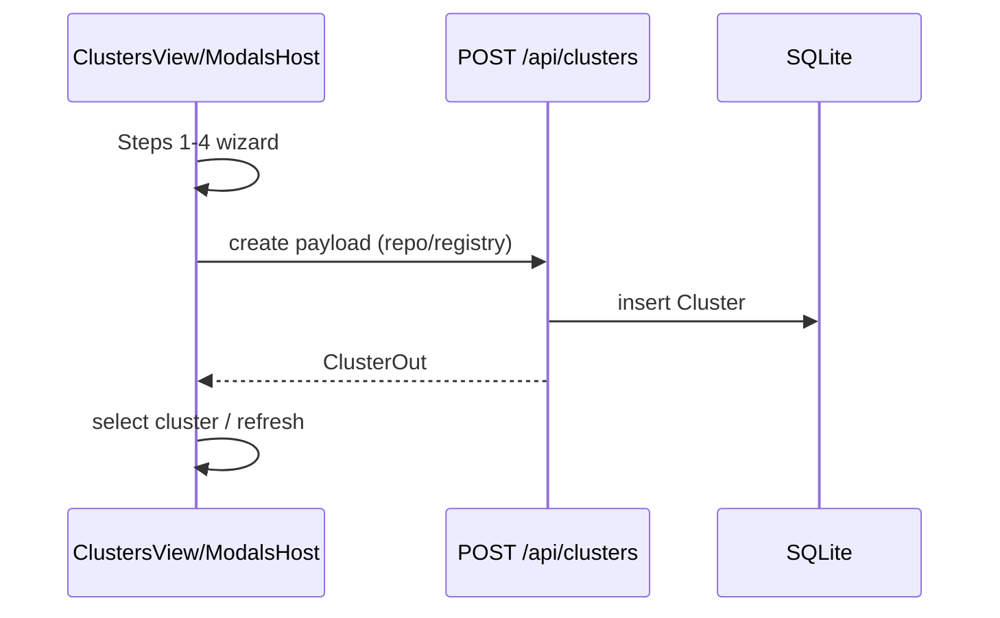
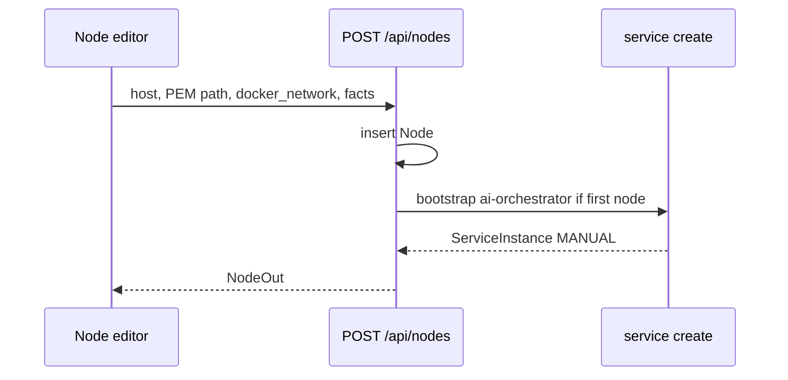
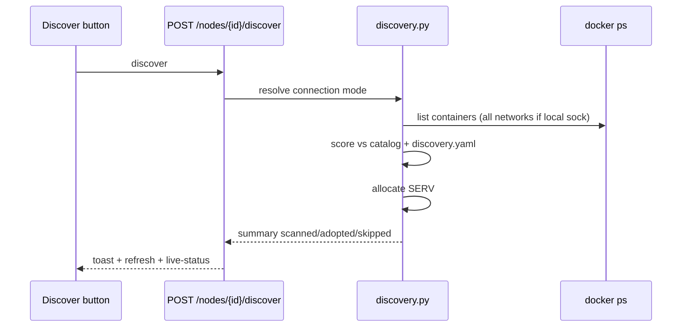
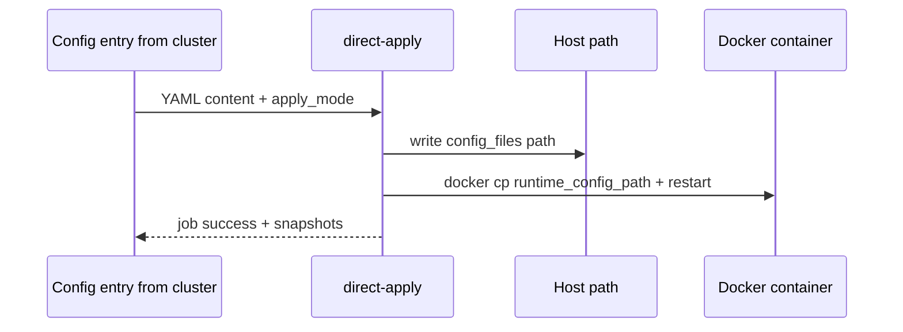

# Cluster Page — Complete Reference (PlatformOps ↔ cPlatform)

**Status:** living reference (written 2026-07-14)  
**Scope:** **Cluster page only** — Cluster → Node → Services, plus **APIs and flows entered from the cluster surface** (deploy modal, install schema, config apply entry, live status, events, performance entry, GlitchTip/runtime patch entry, AIOrchestrator bootstrap).  
**Not in scope:** standalone Config Manager, Diagnostics, Monitoring, Performance, Users product pages (except deep-links *from* cluster).

**Canonical path:** `docs/features/cluster-page-complete-reference.md`  
**Related short inventory:** `docs/features/cluster-page-detailed-features.md`  
**Active execution goal:** [`docs/goal-cluster-page-full-parity.md`](../goal-cluster-page-full-parity.md) — non-deferred items implemented; parity matrix below reflects DONE (Launch VM / pixel CSS deferred)  
**Implementation plans:** `docs/plan-cluster-page-production.md`, `docs/plan-cluster-part-a-hardening.md`  
**Verification runbook:** `docs/runbook-cluster-dtrain.md`

---

## 0. Purpose and rules

### 0.1 Why this document exists

cPlatform’s cluster surface is the operator home. PlatformOps reimplements it as FastAPI + React. Features and “hidden” APIs are spread across:

| Layer | cPlatform | PlatformOps |
|-------|-----------|-------------|
| List UI | `02-clusters.html` | `apps/web/src/views/ClustersView.tsx` |
| Detail UI | `04-cluster-detail.html` + `clusterDetail.js` (~3.5k LOC) | same ClustersView + `ModalsHost` / `DrawersHost` |
| Backend | `ClusterConfig.py`, `NodeConfig.py`, `ServiceConfig.py`, `views.py` user-action dispatch | `routers/clusters.py`, `nodes.py`, `services.py` + orchestrators |
| Forms | `dFormService.json` | dForm import + `catalog/services.yaml` + install-schema API |
| Catalog | `INFRASTRUCTURE_SERVICE_CATALOG` in ServiceConfig | `catalog/services.yaml` + `dependencies.yaml` + `discovery.yaml` |

**Rule:** do **not invent** cluster features. Prefer matching cPlatform behavior from `cplatform_master` (read-only). Prefer **real** docker/SSH/Ansible outcomes over mocked success.

### 0.2 Integrity rules

- No fake healthy status or false “deployed” toasts.
- Live status comes from **docker inspect** (or explicit error / not_found).
- Config apply must change **host file and/or container file** when enabled.
- Discover adopts by **catalog scoring**, not host-specific name denylists.
- Default deploy network for PlatformOps nodes: **`platformops_prod_network`** (isolation from cPlatform’s docker network is intentional for *new* deploys; **discover may still see** cPlatform containers on the host).

### 0.3 Glossary

| Term | Meaning |
|------|---------|
| **Cluster** | Logical grouping of nodes + repo/registry settings |
| **Node** | SSH/docker host belonging to a cluster (`Node` row) |
| **ServiceInstance** | One catalog card instance on a node (DB row + container) |
| **external_id / SERV####** | Stable display ID (cPlatform `SERV1000+`); PlatformOps `ServiceInstance.external_id` |
| **adopted** | Container found via discover; registered without greenfield deploy |
| **install_mode** | `manual` / `MANUAL` vs `ansible` / `ANSIBLE` |
| **live_status** | Real-time container state from docker inspect |
| **contract** | Merged catalog + instance `config_json` (ports, volumes, env, config_files) |
| **dForm** | cPlatform dynamic install form schema (`dFormService.json`) |
| **preflight** | Dependency readiness check before deploy |
| **AIOrchestrator** | Platform control service (cPlatform type; PlatformOps key `ai-orchestrator`) |

---

## 1. Product surface map (cPlatform target UX)

### 1.1 Cluster list (`02-clusters.html`)

**Layout**

- Grid of cluster cards.
- Per card (typical):
  - Name, environment / variant chips
  - Region
  - Repo provider chip, registry chip
  - Aggregates: nodes, services, running counts (server-rendered or refreshed)
- Primary CTA: **Create cluster**
- Card actions: **Open cluster**, **Settings** (edit), sometimes delete from list/detail

**Hardcoded / template defaults (cPlatform)**

| Field | Common default |
|-------|----------------|
| Repo provider | `github` |
| Repo branch | `main` |
| Repo auth | `pat` |
| Environment / variant | product-defined enums (Standalone / Edge / K8s style labels in UI) |

### 1.2 Create / edit cluster wizard (4 steps)

cPlatform stepper labels:

1. **Identity**  
2. **Repository**  
3. **Image store**  
4. **Review**

| Step | Fields | Actions |
|------|--------|---------|
| 1 Identity | Name, region, environment/variant, description/role | Next |
| 2 Repository | Provider (GitHub/GitLab/Bitbucket/self-hosted), URL, branch (`main`), optional monorepo path, auth (PAT / SSH / none) | **Test connection** |
| 3 Image store | DockerHub / ECR / GCR / Harbor / Local; URL; username; password/key; local path if Local | **Test connection** |
| 4 Review | Summary of all choices | **Create cluster** / Save |

**Secrets behavior (cPlatform):** stored encrypted; on edit, leave blank to keep; replace-secret UI for overwrite.

**PlatformOps wizard:** `ModalsHost.tsx` — same 4 steps; `testClusterRepoConnection` / `testClusterRegistryConnection` → `POST /api/clusters/test-repo` / `test-registry`. Secrets blank on edit keep existing (server-side).

### 1.3 Cluster detail shell (`04-cluster-detail.html`)

```
┌─────────────────────────────────────────────────────────────┐
│ Header: cluster name · All clusters · Settings · Delete     │
│          Provision / Add node                               │
├──────────────┬──────────────────────────────────────────────┤
│ Node list    │ Node toolbar: Overview · Events · …          │
│ (search)     │ Spec sheet: vCPU / Mem / Disk / GPU / OS     │
│              │ Utilization (perf)                           │
│              │ Services stack + catalog                     │
└──────────────┴──────────────────────────────────────────────┘
        └── Service detail drawer (Overview | Events | Live Status)
```

**Node-level buttons (cPlatform)**

| Control | Purpose |
|---------|---------|
| Overview | Node facts + utilization |
| Events | Node event timeline |
| Discover | Adopt running containers |
| Edit | Node drawer |
| Delete | Teardown / DB delete (+ cloud destroy if launched) |
| Launch | Cloud VM provision (Terraform) — advanced |
| Catalog | Open service catalog drawer |

**Detail drawer tabs (cPlatform) — critical parity target**

| Tab | Node | Service |
|-----|------|---------|
| **Overview** | Specs, IP, volume, auth type | Name, SERV id, ports, expose, image, adoption |
| **Events** | `node_event` timeline | `service_event` timeline |
| **Live Status** | (often service-focused) | docker inspect payload + refresh |

Footer: **Edit** | **Launch** (nodes) | **Delete**.

### 1.4 Service stack & catalog

- Service cards: name, kind, container, image, ports, status pill, action icons.
- **Catalog drawer:** search, categories (infra vs app), drag/select to install.
- Install path: dynamic **dForm** fields → MANUAL or ANSIBLE → deploy and/or config.
- **expose_service** + **host_port** for infra that may stay internal.
- **Port/name collision** check before create.

### 1.5 PlatformOps current UI (as implemented)

**File:** `apps/web/src/views/ClustersView.tsx`

| Area | Implementation |
|------|----------------|
| List | Cards: nodes, services, running, status pill; Create / Open / Settings |
| Detail header | All clusters, Settings, Delete cluster, Provision node |
| Node list | Left column; search |
| Node toolbar | Validate, Discover, Probe, Live SSH, Edit, Delete |
| Node tabs | **`overview` \| `services` \| `events` \| `live` \| `jobs`** |
| Overview | Spec sheet, onboarding readiness, utilization bars **or** “Open Performance” |
| Services | Live counts, Refresh live, Clean inventory, Add service (catalog); cards open detail drawer + Logs / Config / Deploy / Patch / Uninstall |
| Events | Loads `GET /api/events?node_id=` into dedicated panel state (Refresh events) |
| Live | Node batch live-status list with refresh |
| Jobs | `/api/nodes/{id}/jobs` history |
| Service drawer | **Overview \| Events \| Live status** + expose/host_port save |
| Live poll | Controller: ~5s `refreshNodeLiveStatus` when view=clusters |

**Deferred only:** Launch VM prominence; pixel-perfect CSS density.

---

## 2. cPlatform API inventory (ClusterView “hidden” user-actions)

cPlatform does **not** use REST resource URLs for most cluster ops. The page POSTs to **`/PlatformIO/ClusterView/`** (or related PlatformIO views) with a **`user-action`** string.

### 2.1 Cluster lifecycle

| user-action | Purpose | Side effects |
|-------------|---------|--------------|
| `add_cluster` | Create cluster from wizard | DB insert; may bootstrap primary cluster services |
| `update_cluster` | Edit repo/registry/identity | DB update; secret replace rules |
| `delete_cluster` | Remove cluster | Blocked if nodes remain (`CLUSTER_HAS_NODES` style) |
| `get_cluster_info` | Refresh cluster payload | Read-only |
| `open-cluster-config` | Open settings surface | Navigation / drawer |

**Bootstrap (server):** `ClusterConfig._bootstrap_primary_cluster` → `ServiceConfig.service_add_request(node_id, 'AIOrchestrator')` on primary path.

### 2.2 Node lifecycle

| user-action | Purpose |
|-------------|---------|
| `add_node` | Register node (IP, user, auth, volume, network) |
| `update_node` | Edit node fields |
| `delete_node` | Delete registration; cloud destroy if provisioned |
| `get_node_info` | Facts / connection details |
| `launch_node` | Terraform / cloud VM launch (`NodeConfig.node_launch_request`) |
| `discover_infrastructure` | docker ps + adopt matching services |
| `node_event` | List node events (`NodeEvent.node_get_event_info`) |

**Dedicated URL (performance entry):**  
`GET /PlatformIO/GetNodePerformance/` — used from cluster detail for utilization / perf widgets.

### 2.3 Service lifecycle

| user-action | Purpose |
|-------------|---------|
| `add_service` | Register from catalog + dForm overrides |
| `update_service` | Edit contract (expose, ports, config fields) |
| `deploy_service` | Ansible deploy playbook |
| `delete_service` | Stop/remove container + DB |
| `get_service_info` | Detail payload |
| `service_live_status` | docker inspect; **cache TTL 5s** (`SERVICE_LIVE_STATUS_CACHE_TTL_SECONDS`) |
| `service_event` | Service event timeline |
| `service_runtime_patch` | e.g. GlitchTip / Sentry SDK inject restart path |
| `service_runtime_patch_status` | Patch job status |
| `service_diagnostics` | Diagnostics entry (linked) |
| `service_live_logs` | Live logs entry (linked) |

**Config-related actions** (often invoked *from* cluster Config Manager deep-link; still cluster-entry):

- `service_config_store`, `service_config_checkpoint`, snapshot view/diff/migrate/apply/restore, `validate_yaml`, workspace `get_service_workspace`, `direct_apply_config`, etc. (ConfigManager view).

### 2.4 SERV#### allocation (cPlatform)

- Base: `SERVICE_BASE_IDX = 1000` → `SERV1000`, `SERV1001`, …
- Allocator skips IDs that collide with **existing service IDs** and **reserved runtime container names** on the node (discovered + registered).
- Implementation reference: `ServiceConfig._allocate_service_id`.

### 2.5 Discover / adopt (cPlatform)

1. Ansible/Python discovery on node → container list (name, image, ports, volumes, labels, status).  
2. Match against infra catalog + dForm service types (scored tokens, port hints, image version).  
3. On match: create Service with `adopted=True`, map ports/volumes, skip full deploy.  
4. Multi-instance controlled per type; equivalents map (e.g. glitchtip aliases).

### 2.6 Live status (cPlatform)

- `service_get_live_status` / install helper inspect.  
- Cache keyed by service; **TTL 5 seconds**.  
- UI paints green/yellow/red; detail Live Status tab shows inspect fields.

### 2.7 expose_service / host_port (cPlatform)

- Infra may default **internal** (`expose_service=false`).  
- When exposing, host port bound; UI shows `:port` or `internal`.  
- Collision checker: `check_port_and_name_availability` (and related).

---

## 3. PlatformOps API inventory (cluster-relevant REST)

Auth: session/token via `/api/auth/login` (`email` + `password`). Most routes require Bearer token.

### 3.1 Clusters — `apps/api/platformops/routers/clusters.py`

| Method | Path | Role |
|--------|------|------|
| POST | `/api/clusters` | Create |
| GET | `/api/clusters` | List |
| PUT | `/api/clusters/{id}` | Update |
| DELETE | `/api/clusters/{id}` | Delete (impact rules) |
| GET | `/api/clusters/{id}/summary` | Aggregate summary |
| GET | `/api/clusters/{id}/operations` | Operations feed |
| GET | `/api/clusters/{id}/lifecycle-impact` | Delete impact |
| POST | `/api/clusters/test-repo` | Wizard test repo |
| POST | `/api/clusters/test-registry` | Wizard test registry |

**ClusterOut fields:** id, name, region, environment, repo_*, registry_* (secrets masked).

### 3.2 Nodes — `routers/nodes.py`

| Method | Path | Role |
|--------|------|------|
| GET | `/api/nodes` | List |
| POST | `/api/nodes` | Create (+ **AIOrchestrator bootstrap** on first node) |
| PUT | `/api/nodes/{id}` | Update |
| DELETE | `/api/nodes/{id}` | Delete |
| POST | `/api/nodes/{id}/validate` | Ansible validate-node job |
| GET | `/api/nodes/{id}/connection` | Connection report + `live_probe` |
| GET | `/api/nodes/{id}/onboarding-readiness` | Checklist |
| POST | `/api/nodes/{id}/onboarding-remediate` | Remediation action |
| POST | `/api/nodes/{id}/discover` | Discover + adopt |
| GET | `/api/nodes/{id}/live-status` | Batch live status for node services |
| POST | `/api/nodes/{id}/inventory/cleanup` | Soft inventory cleanup (DB rows) |
| GET | `/api/nodes/{id}/jobs` | Job history |
| GET | `/api/nodes/{id}/summary` | Node summary |
| GET | `/api/nodes/{id}/metrics` | Utilization (Prometheus-backed when available) |
| GET | `/api/nodes/{id}/lifecycle-impact` | Delete impact |
| GET | `/api/nodes/{id}/deployment-plan/{service_key}` | Ordered deploy plan |
| GET | `/api/nodes/{id}/check-port-and-name` | Collision check |
| POST | `/api/nodes/{id}/launch-vm` | Cloud launch (API; UI advanced/deferred) |
| POST | `/api/nodes/{id}/teardown-vm` | Cloud teardown |
| POST | `/api/nodes/{id}/observability/bootstrap` | Obs plane bootstrap |
| GET | `/api/nodes/{id}/artifacts/inventory` | Generated inventory artifact |
| GET | `/api/nodes/{id}/artifacts/compose` | Generated compose artifact |
| POST | `/api/nodes/{id}/capacity` | Capacity report |
| GET | `/api/nodes/{id}/subsystems/{subsystem}/rollout-plan` | Subsystem plan |
| POST | `/api/nodes/{id}/subsystems/{subsystem}/deploy` | Subsystem deploy |

**NodeCreate defaults (schema):**

- `host=localhost`, `ssh_user=ubuntu`  
- `volume_root=/tmp/platformops`  
- `docker_network=platformops_prod_network`  
- `environment=local`  
- `facts={}`

**AIOrchestrator bootstrap:** `_bootstrap_ai_orchestrator_if_needed` on node create when cluster has no `ai-orchestrator` / `AIOrchestrator` / `cplatform` service and node is first/only — creates MANUAL registration (`install_mode=manual`, `bootstrap=true`).

### 3.3 Services — `routers/services.py` (cluster-entry subset)

| Method | Path | Role |
|--------|------|------|
| GET | `/api/services` | List all |
| POST | `/api/services` | Create/register card |
| PATCH | `/api/services/{id}` | Update overrides |
| POST | `/api/services/{id}/preflight` | Dependency preflight |
| POST | `/api/services/{id}/dependencies/install-missing` | Deploy missing deps |
| POST | `/api/services/{id}/deploy` | Deploy job |
| POST | `/api/services/{id}/deployment/execute` | Plan + auto deps + target deploy |
| POST | `/api/services/{id}/delete` | Uninstall job |
| GET | `/api/services/{id}/live-status` | Single service live |
| GET | `/api/services/{id}/capabilities` | diagnostics/config/backup flags |
| GET | `/api/services/{id}/config` | Config workspace (cluster Config button) |
| POST | `/api/services/{id}/config/direct-apply` | Apply YAML (UI path) |
| POST | `/api/services/{id}/config/apply` | Apply job (async script path) |
| … | snapshots, drift, migration, rename, restore | Config manager APIs (entry from cluster) |
| GET | `/api/jobs/{id}` | Poll job |
| GET | `/api/jobs/{id}/logs` | Job logs |

**ServiceCreate:** `node_id`, `service_key`, optional `name`, `contract_overrides`, `install_mode`.

**ServiceOut:** includes `external_id` (SERV####).

### 3.4 Catalog / events — cluster entry

| Method | Path | Role |
|--------|------|------|
| GET | `/api/catalog/services` | Catalog cards |
| GET | `/api/catalog/services/{key}/install-schema` | dForm + contract fields |
| GET | `/api/events` | Operational events (node filter client-side) |

### 3.5 FE wiring map (cluster page)

| UI control | Action module | API |
|------------|---------------|-----|
| Create/Edit cluster | `inventoryEditorActions` | clusters CRUD + test-repo/registry |
| Provision / Edit node | `inventoryEditorActions` + stepper drawer | nodes CRUD |
| Validate | `sreActions.validateNode` | `POST .../validate` |
| Discover | `inventoryLoadActions.discoverNodeInfra` | `POST .../discover` |
| Probe | `loadNodeConnection` | `GET .../connection` |
| Live SSH / Refresh live | `refreshNodeLiveStatus` | `GET .../live-status` |
| Clean inventory | `cleanupNodeInventory` | `POST .../inventory/cleanup` |
| Add service / catalog | `inventoryDeployActions` | install-schema + `POST /api/services` |
| Deploy icon / modal | `openDeploymentModal` / `executeDeploymentModal` | preflight, plan, execute, deploy |
| Config icon | `loadConfig` → activeView `config` | `GET .../config`, direct-apply |
| Logs icon | `loadDiagnostics` → diagnostics view | diagnostics APIs (entry only) |
| Uninstall / delete | `requestDelete` / confirm | lifecycle-impact + delete |
| Events tab | filtered `events` | `GET /api/events` (loaded in refresh) |
| Jobs tab | `nodeJobHistory` | `GET .../jobs` |
| Open Performance | `setActiveView("performance")` | metrics APIs on Performance page |

---

## 4. Domain model (PlatformOps)

```
Cluster
  id, name, region, environment
  repo_type, repo_url, repo_branch, repo_token
  registry_type, registry_url, registry_user, registry_password

Node
  id, cluster_id, name, host, ssh_user, ssh_key_path
  environment, volume_root, docker_network, status
  facts_json   # cpu_cores, memory_gb, storage_gb, gpu, os, probes...

ServiceInstance
  id (PK)
  external_id          # SERV####
  node_id, service_key, name, kind
  container_name, image, status
  config_json          # contract: ports, volumes, config_files, adopted, install_mode, ...

DeploymentJob / OperationalEvent / ConfigSnapshot
  linked by service_id / node_id
```

**Orchestrator modules**

| Module | Cluster role |
|--------|----------------|
| `orchestrator/discovery.py` | docker ps, score, adopt, `normalize_docker_ports` |
| `orchestrator/ids.py` | SERV#### allocation |
| `orchestrator/dform.py` | dForm → install-schema |
| `orchestrator/service/impl.py` | create, deploy, preflight, ports, plan |
| `orchestrator/config.py` | read/apply config, capabilities, snapshots |
| `orchestrator/node.py` | validate, connection, onboarding, cleanup, jobs |
| `catalog.py` + YAML | contracts, deps, discovery policy |

---

## 5. Hardcoded values and policies

### 5.1 PlatformOps intentional defaults

| Item | Value | Where |
|------|-------|--------|
| Docker network | `platformops_prod_network` | NodeCreate schema, inventoryEditorActions |
| Volume root | `/tmp/platformops` | NodeCreate |
| Node fact fallback | cpu 4, mem 16, disk 100, gpu none, os linux | inventoryEditorActions |
| Connection mode | `auto` → local-fallback when PEM missing in API container | settings + node probe |
| Discover min score | 30 | `catalog/discovery.yaml` |
| Ambiguity margin | 8 | discovery.yaml |
| Network affinity | **off** (`prefer_node_network: false`, boost/penalty 0) | discovery.yaml |
| Live poll interval (FE) | ~5s on clusters view | usePlatformController |
| SERV base | 1000-class via ids allocator | orchestrator/ids.py |
| dTrain deps | rabbitmq-core, redis-core, dtrain-tracker | dependencies.yaml |
| Auth demo | admin / admin (bootstrap) | settings / users |
| Type aliases | AIOrchestrator→cplatform/ai-orchestrator, TrainingServer→dtrain | settings.py |

### 5.2 cPlatform intentional constants

| Item | Value |
|------|-------|
| SERVICE_BASE_IDX | 1000 |
| LIVE_STATUS_CACHE_TTL | 5 seconds |
| SERVICE_DEPLOY_MAX_RETRY | 6 |
| Primary bootstrap | AIOrchestrator on primary cluster path |
| Infra catalog | Large hardcoded INFRASTRUCTURE_SERVICE_CATALOG in ServiceConfig.py |
| Equivalents | e.g. glitchtip aliases, postgres consumers |

### 5.3 Port format trap (critical)

| Source | Example | Ansible published_ports |
|--------|---------|-------------------------|
| docker ps string | `0.0.0.0:9006->8000/tcp` | **invalid** if stored raw |
| Normalized | `9006:8000` | valid |
| Catalog | `8102:8080` | valid |

**PlatformOps fix:** `normalize_docker_ports()` in discovery; deploy path merges catalog + normalizes instance ports before writing job vars.

### 5.4 Config apply path (cluster Config button)

1. FE: Config icon → `loadConfig(service)` → Config view (cluster entry).  
2. Apply: `POST /api/services/{id}/config/direct-apply` with `{ content, apply_mode }`.  
3. Backend: validate YAML → snapshot → write host `config_files` paths → `docker cp` to `runtime_config_path` → restart if needed → job **success** if write landed.  
4. Proven service: **dTrain controller** host `/tmp/platformops/dtrain/controller/config/dtrain_config.yaml` → container `/app/config/dtrain_config.yaml`.

Ansible helper `service_config_apply.sh` uses `maybe_sudo` when sudo absent (API container).

---

## 6. End-to-end flows

### 6.1 Create cluster



### 6.2 Add node + AIOrchestrator bootstrap



### 6.3 Discover and adopt



### 6.4 Catalog onboard → deploy or config

1. Open catalog → `openCatalogOnboarding(card)`.  
2. `GET /api/catalog/services/{key}/install-schema?node_id=`.  
3. User sets MANUAL/ANSIBLE + dForm fields + expose/host_port.  
4. `POST /api/services` with overrides.  
5. Next action: **config** → loadConfig; **deploy** → openDeploymentModal.  
6. Deploy: preflight → optional install-missing → `deployment/execute` or `deploy`.  
7. Jobs poll until success/fail; live status updates pills.

### 6.5 Config apply (real container)



### 6.6 Delete with safety

1. `requestDelete` → lifecycle-impact API.  
2. Confirm modal; force-delete approval path if required.  
3. Service delete runs Ansible remove; node/cluster blocked when children exist.

---

## 7. Feature parity matrix

Legend: **Y** = present · **P** = partial · **N** = missing · **D** = deferred intentionally

| Feature | cPlatform | PO FE | PO API | Proven live | Gap / notes | Priority |
|---------|-----------|-------|--------|-------------|-------------|----------|
| Cluster list cards | Y | Y | Y | Y | Visual fidelity still lighter | Med |
| 4-step create wizard | Y | Y | Y | Y | Fewer provider chips than cP | Med |
| Test repo/registry | Y | Y | Y | Y | | Low |
| Edit cluster settings | Y | Y | Y | Y | Secret replace UX simpler | Med |
| Delete cluster + safeguards | Y | Y | Y | Y | | Low |
| Node list + select | Y | Y | Y | Y | | Low |
| Node spec sheet (facts) | Y | Y | Y | P | Defaults if not probed | Med |
| Validate node | Y | Y | Y | Y | PEM missing → local fallback | Med |
| Discover / adopt | Y | Y | Y | Y | cPlatform nets allowed (score) | Low |
| Probe / connection | Y | Y | Y | Y | local-fallback | Med |
| Live status batch | Y | Y | Y | Y | | Low |
| Live status detail drawer tab | Y | Y | Y | Y | Node Live tab + service drawer Live status panel | Done |
| Node Events button/tab | Y | Y | Y | Y | Events tab loads `GET /api/events?node_id=` into panel state | Done |
| Service Events timeline | Y | Y | Y | Y | Service drawer Events tab loads `service_id` scoped events | Done |
| Jobs history on node | P | Y | Y | Y | PO stronger on jobs tab | Done |
| Catalog drawer | Y | Y | Y | Y | | Done |
| dForm install schema | Y | Y | Y | Y | Full import path present | Done |
| MANUAL vs ANSIBLE | Y | Y | Y | Y | | Done |
| expose_service + host_port | Y | Y | Y | Y | Drawer edit + ServiceOut flags + port check | Done |
| Port/name collision check | Y | Y | Y | Y | Catalog onboard + expose save | Done |
| SERV#### IDs | Y | Y | Y | Y | | Done |
| Deploy modal + plan | Y | Y | Y | Y | dTrain deploy proven | Done |
| Auto install deps | Y | Y | Y | Y | tracker proven | Done |
| Config entry from card | Y | Y | Y | Y | Opens Config view | Done |
| Config apply real container | Y | Y | Y | Y | dTrain proven success | Done |
| Uninstall service | Y | Y | Y | Y | | Done |
| AIOrchestrator bootstrap | Y | Y | Y | Y | First-node MANUAL registration | Done |
| AIOrchestrator delete guard | Y | Y | Y | Y | lifecycle + delete_service block → 409 | Done |
| GlitchTip runtime patch from card | Y | Y | Y | Y | Card + drawer call real patch API; toast only on success:true | Done |
| Launch cloud VM | Y | D | Y | N | Deferred product; API remains | Deferred |
| Performance from node | Y | Y | Y | Y | Overview metrics + Open Performance entry | Done |
| Clean inventory | — | Y | Y | Y | PlatformOps-specific safety tool | — |
| Inventory cleanup protect orchestrator | — | Y | Y | Y | | — |
| High-fidelity CSS match | Y | P | — | — | Layout improved, not pixel-perfect | Med |
| Typed toasts | Y | Y | — | Y | useUiState | Low |
| Continuous live poll | Y | Y | Y | Y | 5s | Low |

---

## 8. AIOrchestrator, GlitchTip, Performance (cluster entry only)

### 8.1 AIOrchestrator

| Aspect | cPlatform | PlatformOps |
|--------|-----------|-------------|
| Type key | `AIOrchestrator` | catalog `ai-orchestrator` (aliases AIOrchestrator/cplatform) |
| Bootstrap | Primary cluster create | First node create on cluster |
| Install | Often special path | MANUAL registration by default |
| Delete guard | Cannot delete while other services exist | Partial — enforce fully |
| Config | cPlatform_config paths in ansible helpers | Catalog often empty `config_files` → apply_enabled false |

### 8.2 GlitchTip / runtime patch

- cPlatform: `service_runtime_patch` / `service_runtime_patch_status` from cluster JS.  
- PlatformOps: monitoring actions (`runPatchObservability`, etc.) exist for Monitoring surface; **not first-class on Clusters service card**.  
- Future cluster parity: service card action → patch API → restart → live status refresh.

### 8.3 Performance connection

- cPlatform: `GetNodePerformance` from detail JS.  
- PlatformOps: Overview shows metrics if loaded; else **Open Performance** switches `activeView`.  
- Cluster-owned piece: wire metrics load on node select (partially done via controller effects).

---

## 9. What should be done next (cluster-only backlog)

Ordered for maximum cPlatform visual/behavioral parity on **this page only**:

### P0 — Operator truthfulness (mostly done; keep green)

1. Live status real docker inspect + poll  
2. Discover score-only (no illegal denylist)  
3. Config apply success when host/container written  
4. Deploy ports normalized; deps install works  
5. Buttons use real `s.setNotice` wiring  

### P1 — UX structure parity with cPlatform detail — **DONE**

1. **Service/Node detail drawer** with tabs: Overview | Events | Live Status — **DONE**  
2. **Node Events** and **Service Events** panels (`GET /api/events` scoped) — **DONE**  
3. **Edit service** expose/host_port on drawer — **DONE**  
4. **AIOrchestrator** delete guard + first-node bootstrap — **DONE**  

### P2 — Advanced cluster-entry features

1. GlitchTip / runtime patch from service card — **DONE** (toast only when `success===true`)  
2. Performance entry from Overview — **DONE** (deep-link + metrics when available)  
3. Launch VM UI — **DEFERRED**  
4. Port collision on catalog onboard — **DONE**  
5. PEM mount for true remote SSH — ops optional  

### P3 — Visual polish (deferred)

1. Density/spacing match `clusterDetail.css` — deferred  
2. Catalog categories / drag-drop if required — deferred  
3. Secret replace UX for cluster settings — simpler replace OK  

---

## 10. File and module index

### 10.1 cPlatform (read-only)

| Path | Role |
|------|------|
| `templates_new/PlatformIO/02-clusters.html` | Cluster list + wizard markup |
| `templates_new/PlatformIO/04-cluster-detail.html` | Detail layout, drawers, catalog |
| `static/javascript/clusterDetail.js` | All interactive logic + user-actions |
| `static/css/cluster.css`, `clusterDetail.css` | Visual system |
| `cPlatformIO/src/ClusterConfig.py` | Cluster CRUD + bootstrap |
| `cPlatformIO/src/ServiceConfig.py` | SERV, discover, live, infra catalog |
| `cPlatformIO/src/NodeConfig.py` | Node CRUD + launch |
| `cPlatformIO/src/NodeEvent.py` | Node events |
| `cPlatformIO/views.py` | user-action dispatch |
| `cPlatformIO/forms/dFormService.json` | Install forms |

### 10.2 PlatformOps

| Path | Role |
|------|------|
| `apps/web/src/views/ClustersView.tsx` | Cluster page UI |
| `apps/web/src/views/ModalsHost.tsx` | Cluster wizard, deploy modal, delete |
| `apps/web/src/views/DrawersHost.tsx` | Catalog + node stepper |
| `apps/web/src/platform/actions/inventory*.ts` | Cluster/node/service actions |
| `apps/web/src/platform/actions/configActions.ts` | Config apply (entry) |
| `apps/web/src/platform/usePlatformController.tsx` | Live poll, refresh |
| `apps/api/platformops/routers/clusters.py` | Cluster REST |
| `apps/api/platformops/routers/nodes.py` | Node REST + bootstrap |
| `apps/api/platformops/routers/services.py` | Service REST + config |
| `apps/api/platformops/orchestrator/discovery.py` | Discover/adopt |
| `apps/api/platformops/orchestrator/config.py` | Config apply |
| `apps/api/platformops/orchestrator/service/impl.py` | Deploy/preflight |
| `catalog/services.yaml` | Service contracts |
| `catalog/discovery.yaml` | Discover policy |
| `catalog/dependencies.yaml` | Deploy deps |
| `ops/ansible/playbooks/docker_service.yml` | Deploy/remove containers |
| `ops/ansible/playbooks/service_config_apply.sh` | Config apply helper |

---

## 11. Verification appendix (cluster-only smoke)

Environment used in production hardening sessions:

| Item | Value |
|------|--------|
| API | `http://127.0.0.1:9002` |
| Login | `email=admin`, `password=admin` |
| Node | id **12** `verify-node-1`, network `platformops_prod_network` |
| dTrain | service **85** `node-1-dtrain-controller` |
| Tracker | service **101** `node-12-dtrain-tracker` |
| Config path | `/tmp/platformops/dtrain/controller/config/dtrain_config.yaml` |

**Minimum smoke checklist**

1. Login → list clusters → open cluster → select node.  
2. Probe → connection_state + live_probe.  
3. Discover → summary with scanned/adopted; cPlatform containers may appear.  
4. Live status → running_count matches docker.  
5. Config (dTrain) → apply marker → host + container contain marker; job **success**.  
6. Preflight → ok when deps running.  
7. Deploy dTrain → Ansible job **success**.  
8. Events/jobs tabs populate for node-scoped activity.  
9. Delete impact checks prevent unsafe deletes.

**Known operational shortcuts**

- API container may lack PEM → `connection_mode: local-fallback` with host docker socket.  
- `deployment/execute` may return `ok: false` while target job still **running**; poll job to terminal state.  
- Greenfield image pull/deploy still depends on host images and network.

---

## 12. How to use this document later

1. **Adding a cluster UI control** → find cPlatform control in §1 → user-action in §2 → add REST+FE in §3 style → update parity matrix §7.  
2. **Debugging discover/deploy/config** → §5 hardcodes + §6 flows + §11 smoke.  
3. **Prioritizing work** → §9 backlog; do not expand to other pages.  
4. **Never** treat Config/Diagnostics full product docs as cluster scope; only cluster **entry points**.

---

## 13. Document history

| Date | Change |
|------|--------|
| 2026-07-14 | Initial complete reference: cPlatform surface + PlatformOps REST/FE + hardcodes + parity + backlog after dTrain config/deploy verification and main push `b4d8540` era |

---

*End of cluster-page complete reference.*
