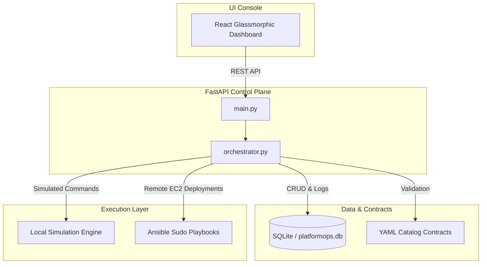

# PlatformOps & cPlatform Parity: Comprehensive Project Guide & Technical Audit

This document provides an in-depth audit of the **PlatformOps** repository, describing its purpose, core capabilities, codebase quality, architectural lineage, and its relationship to **cPlatform** (acting as a portfolio-safe, fully simulated miniature version).

---

## 1. Executive Summary

### What is PlatformOps?
**PlatformOps** is a portfolio-grade SRE and developer control plane. It represents the architectural patterns of modern Internal Developer Platforms (IDPs), such as service catalogs, topological rollout engines, dependency-aware lifecycle governance, and operational observability sweeps.

### What Does it Do?
- **Registers Services & Dependencies**: Dynamically loads 39 distinct application, infrastructure, and helper cards defined as contract metadata in `catalog/services.yaml` and `catalog/dependencies.yaml`.
- **Topological Rollout Sequencer**: Computes boot timelines for multi-card service planes (e.g., `vector-plane`, `workflow-plane`, `distributed-training-plane`), ensuring databases and messaging systems bootstrap before target applications.
- **Deploys and Simulates Actions**: Supports two execution modes:
  1. **Ansible Sudo Playbooks**: Triggers real docker container actions on remote AWS EC2 Linux nodes.
  2. **Local Simulation Mode**: Automatically runs in a safe mockup state, recording target commands to database logs while updating SQLite statuses without altering host machine states.
- **Dependency Guardrails (Lifecycle Governance)**: Restricts raw deletions of database cards (`postgres-core`, `redis-core`, etc.) or cards with active dependent services. Users must request a "Force Delete", provide an active maintenance window, and submit a detailed justification (>12 characters) to pass security gates.
- **Diagnostics, Config, and Backup Audits**: Inspects running systems for capability drift, scans for databases missing backup policies, masks secrets, and aggregates SLO error-budget data.

---

## 2. Code Quality Audit: Is It "Slop Code"?

> [!IMPORTANT]
> **Conclusion: Absolutely not.** PlatformOps is an exemplary SRE portfolio codebase. It demonstrates industry-standard clean coding practices, type safety, modular structures, and resilient database mappings.

### Criteria Comparison

| Quality Dimension | "Slop Code" Pattern | PlatformOps Implementation |
| :--- | :--- | :--- |
| **Database Schema** | Poorly structured tables, no foreign keys, lack of constraints, and raw SQL strings. | **SQLAlchemy 2.0 type mapping** (`Mapped`, `mapped_column`) with explicit foreign keys, cascading deletions (`delete-orphan`), and relational properties. |
| **API Architecture** | Monolithic routes, lack of request/response schemas, poor status codes, and unhandled errors. | **FastAPI structure** utilizing **Pydantic schemas** for input/output sanitization, dependency injection (`Depends(get_db)`), and descriptive HTTP statuses (e.g., `409 Conflict` for blocked deletes). |
| **Logic & Algorithms** | Nested loops, hardcoded parameters, and brittle logic. | **Topological sorting algorithms** (`_dependency_order`) utilizing depth-first search (DFS) with cycle-detection parameters. |
| **Configuration** | Settings hardcoded in files, environment variables parsed manually. | **Pydantic Settings** (`BaseSettings`) loading configuration parameters cleanly with support for environment prefixing (`PLATFORMOPS_`). |
| **Verification & Tests** | Missing testing suites, or simple "assert True" dummy files. | **Comprehensive verification harness** (`scripts/verify_platformops.py`) executing over **330 lines** of end-to-end API validations, lifecycle blocks, rollout ordering, and secret rotation audits. |

### Technical Code Highlights

#### A. SQLAlchemy 2.0 Object Mappings (`models.py`)
PlatformOps uses modern Python type hinting to enforce database contracts. Relationships are clearly defined:
```python
class Node(Base):
    __tablename__ = "nodes"
    id: Mapped[int] = mapped_column(Integer, primary_key=True)
    cluster_id: Mapped[int] = mapped_column(ForeignKey("clusters.id"))
    ...
    cluster: Mapped[Cluster] = relationship(back_populates="nodes")
    services: Mapped[list["ServiceInstance"]] = relationship(back_populates="node", cascade="all, delete-orphan")
```

#### B. Topological Dependency Sorting (`orchestrator.py`)
Rather than deploying cards randomly, the orchestrator computes dependency trees:
```python
def _dependency_order(service_key: str, seen: set[str] | None = None) -> list[str]:
    seen = seen or set()
    ordered: list[str] = []
    for dependency_key in required_dependencies(service_key):
        if dependency_key in seen:
            continue
        seen.add(dependency_key)
        ordered.extend(_dependency_order(dependency_key, seen))
        ordered.append(dependency_key)
    return ordered
```

---

## 3. Mini-cPlatform Comparison & Parity Map

PlatformOps mimics the architectural concepts of **cPlatform**—a sophisticated internal developer control plane—while keeping dependencies portfolio-safe.



### Feature Parity Analysis

1. **Service Catalog Parity**
   - **cPlatform**: Uses custom Kubernetes CRDs or configuration registers to represent hundreds of backing cards.
   - **PlatformOps**: Simulates this using 39 defined services in `catalog/services.yaml`, categorized by tier (`kind: app / infrastructure / helper`) and `subsystem`.

2. **Topological Planes**
   - **cPlatform**: Groups services into logical infrastructure planes (e.g. data mesh, training pipelines).
   - **PlatformOps**: Groups cards into planes via YAML subsystems. For example, in the **Distributed Training Plane**, it ensures `rabbitmq-core` and `redis-core` are initialized prior to booting `dtrain-tracker`, `dtrain-controller`, and `dtrain-worker` nodes.

3. **Isolated Backing Stores**
   - **cPlatform**: Enforces isolation policies so app teams don't contaminate shared database instances.
   - **PlatformOps**: Models this in the **Workflow Plane** (`Airflow`). Airflow's rollout plan maps `airflow-postgres` and `airflow-redis` as dedicated local backing stores, keeping them completely separate from the global `postgres-core` and `redis-core` instances.

4. **Security & Force-Delete Gates**
   - **cPlatform**: Restricts deletions of active nodes/clusters to prevent database cascading outages.
   - **PlatformOps**: Implements `lifecycle_impact()` logic. Normal service deletions are blocked if dependents exist. Force deletion enforces a compliance gate:
     ```python
     if requires_active_maintenance:
         windows = _active_maintenance_windows(db, service_id=service.id, node_id=service.node_id)
         active_window_ids = [window.id for window in windows]
         if not active_window_ids:
             violations.append("Force delete requires an active maintenance window for this service or node.")
     ```

---

## 4. Guide to Components & System Interactions

### Data Flow for a Service Lifecycle Event
1. **Catalog Load**: On boot, FastAPI loads all contracts from `/catalog` into memory.
2. **Card Registration**: A request to `/api/services` seeds a `ServiceInstance` record in SQLite, pulling configurations from the catalog contract.
3. **Rollout Planning**: Requesting `/api/nodes/{node_id}/subsystems/{subsystem}/rollout-plan` runs a topological sort of the plane and determines if pre-requisites are met.
4. **Deploy Execution**: `/api/services/{id}/deploy` compiles parameters into an Ansible variables file (`vars_*.json`) and runs `ansible-playbook`. In local mode, this outputs log entries into `DeploymentJob` and updates the SQLite status without touching Docker.
5. **Continuous Verification**: A background monitoring loop evaluates service status, generates capacity summaries, evaluates SLO thresholds, and raises incidents for out-of-sync configuration drifts.
